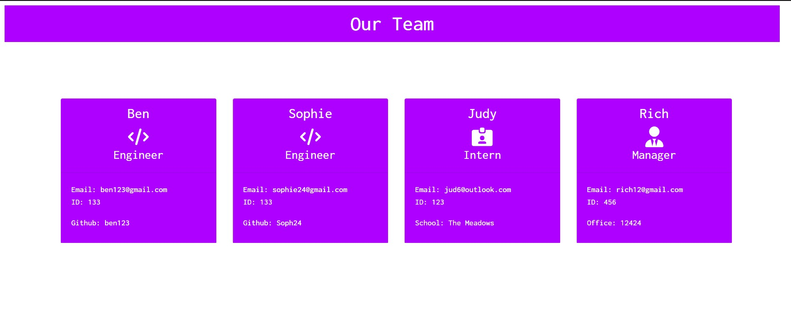

#  <p align="center"> Team Profile Generator </p>

 <p align="center">
  
</p>

## <p align="center"> Description </p>

This is a simple application which generates a team profile using inquirer npm package. When a user initiates the program as stated above, they will be required to answer a series of questions about their team. Once the user has added all desired team members, then a html file will be generated containing information the entered by the user.

Link to demo video - https://watch.screencastify.com/v/vskRqDywMGqjzOgqP4qk

## <p align="center"> Installation </p>

*Node must be installed.

``` 
npm i

```

## 

```
node index.js

```
Answer the questions as prompted. After this step is completed, you should find the generated index.html file under the folder 'dist'.

## License
[MIT](https://choosealicense.com/licenses/mit/)
